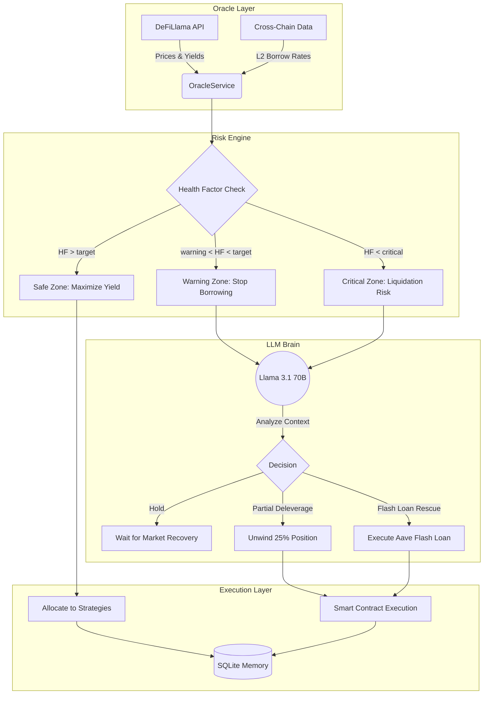

# Aegis DeFAI Terminal




Aegis DeFAI Terminal is an autonomous, AI-driven DeFi agent designed to execute delta-neutral yield strategies, manage portfolio risk dynamically, and optimize returns across multiple protocols (Aave, Morpho, Pendle, Ethena).

## Features
- **Autonomous Yield Farming:** Automatically allocates capital to the highest-yielding delta-neutral strategies.
- **Dynamic Risk Engine:** Monitors Health Factor (HF) and automatically executes partial deleveraging or flash loan rescues when risk thresholds are breached.
- **Multi-Protocol Support:** Integrates with Aave V4, Morpho Blue, Pendle, and Ethena.
- **Real-Time Terminal:** A beautiful, responsive frontend to monitor agent decisions, portfolio TVL, and live yields.
- **Simulation Mode:** Run the agent in a simulated environment before deploying real capital.

📖 **Curious about how the AI makes decisions?** Check out our detailed guide:
- [🇬🇧 How It Works (English)](docs/HOW_IT_WORKS.md)
- [🇹🇷 Nasıl Çalışır? (Türkçe)](docs/HOW_IT_WORKS_TR.md)

## Getting Started

### Prerequisites
- Node.js (v22.5+)
- Docker (optional, for containerized deployment)

### Local Setup
1. Clone the repository:
   ```bash
   git clone https://github.com/your-org/aegis-defai-terminal.git
   cd aegis-defai-terminal
   ```
2. Setup the backend:
   ```bash
   cd backend
   npm install
   cp .env.example .env
   # Edit .env and add your OpenRouter API Key and RPC URL
   npm run dev
   ```
3. Setup the frontend:
   ```bash
   cd ../frontend
   npm install
   npm run dev
   ```

### Docker Setup
```bash
docker-compose up --build
```

## Configuration Guide (API Keys & RPC)

To run the agent, you need two critical pieces of information: an **OpenRouter API Key** (for the AI) and an **EVM RPC URL** (to read blockchain data).

### 1. How to get an OpenRouter API Key
1. Go to [OpenRouter.ai](https://openrouter.ai/) and sign up.
2. Navigate to the **Keys** section in your dashboard.
3. Click **Create Key**, give it a name (e.g., "Aegis Terminal"), and copy the generated key.
4. *Note: OpenRouter provides access to Llama 3.1 70B and other models. You may need to add a few dollars of credit for the agent to run continuously.*

### 2. How to get a Sepolia RPC URL (or Mainnet)
1. Go to [Alchemy](https://www.alchemy.com/) or [Infura](https://www.infura.io/) and sign up for a free account.
2. Create a new App/Project.
3. Select the **Ethereum** network and **Sepolia** testnet (or Mainnet if deploying real capital).
4. Copy the **HTTPS URL** (it should look like `https://eth-sepolia.g.alchemy.com/v2/YOUR_API_KEY`).

### 3. Where to enter these settings
You have two options to configure the terminal:
- **Option A (UI Method):** Start the frontend and backend. Open the terminal in your browser, click **Settings** in the sidebar, and paste your keys into the respective fields. The backend will securely encrypt and store them in the SQLite database.
- **Option B (.env Method):** Open `backend/.env` and paste your keys into `OPENROUTER_API_KEY` and `EVM_PROVIDER_URL`. The system will automatically read them on startup.

### 4. Optional security (exposed deployments)

For deployments exposed beyond `localhost`, set these environment variables in `backend/.env`:

| Variable | Effect |
|---|---|
| `AEGIS_API_KEY` | When set, every REST `/api/*` request must send `x-api-key: <key>`. The browser key is entered on the **Settings → API Access Key** page (stored locally). |
| `WS_API_KEY` | WebSocket auth key. The browser presents it as a `Sec-WebSocket-Protocol` subprotocol (not a query string). In `NODE_ENV=production` handshakes without the exact key are rejected. |

Monitoring: Prometheus metrics are exposed at `GET /metrics` (HTTP request count/duration, WS clients, portfolio TVL, agent running state).

## Architecture
- **Backend:** Node.js, Express, node:sqlite (built-in SQLite), WebSocket, Prometheus.
- **Frontend:** React, Vite, TailwindCSS.
- **AI Engine:** OpenRouter (Llama 3.1 70B Instruct).
- **Layered agent core:** `RiskEngine` → `DecisionEngine` (LLM + guardrails) → `ExecutionLayer` (simulation or on-chain backend). The decision engine is identical for both — only execution changes.

## Contributing
We welcome contributions! Please see [CONTRIBUTING.md](CONTRIBUTING.md) for details on how to submit pull requests, report issues, and our coding standards.

## License
This project is licensed under the MIT License - see the [LICENSE](LICENSE) file for details.
