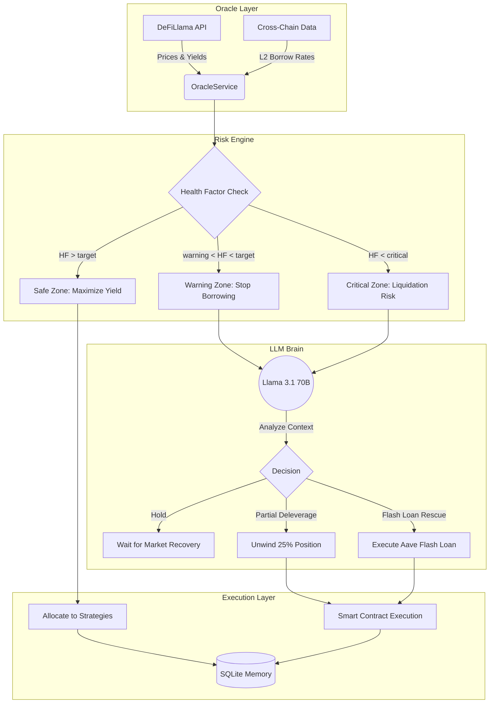
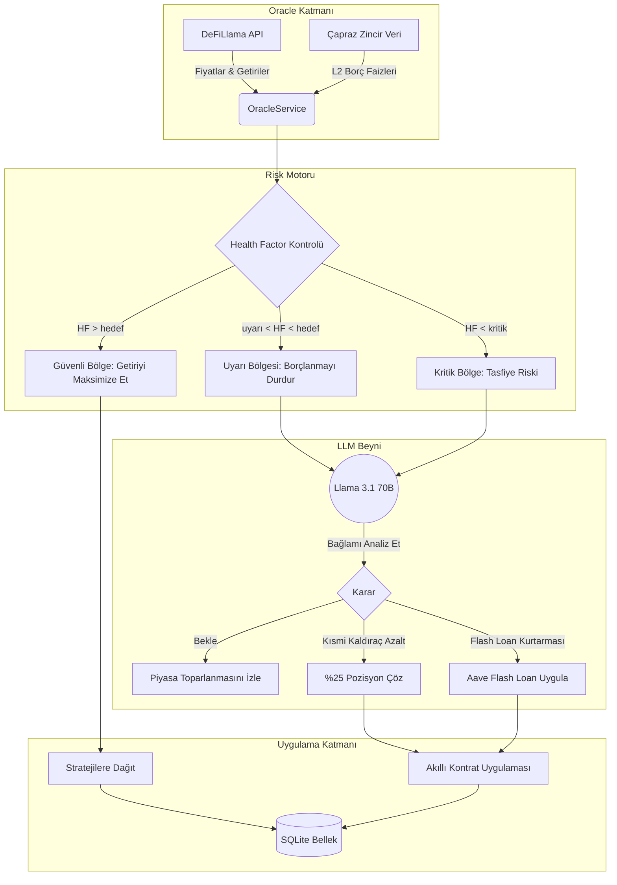

<p align="center">
  
  
  
  
  
  
  
  
  
  
</p>

<p align="center">
  
  
  
  
  
  
  
  
</p>

---

<p align="center">
  <a href="#english"></a>
  <a href="#turkce"></a>
</p>

<p align="center">
  <em>🛡️ An autonomous, AI-driven DeFi agent that farms delta-neutral yield, watches over your health factor like a guardian, and rescues your position before liquidation — 24/7.</em>
</p>

---

<a id="english"></a>

# 🛡️ Aegis DeFAI Terminal — English

> **Autonomous DeFi yield agent.** Aegis runs a **delta-neutral yield farming** strategy across Aave, Morpho, Pendle and Ethena. It reads live market data, reasons with an **LLM brain (Llama 3.1 70B via OpenRouter)**, monitors your **Health Factor** in real time, and acts — automatically.

```
┌──────────────────────────────────────────────────────────────────┐
│   📡 Oracle Layer      →  🌐 Live DeFiLlama prices & L2 rates     │
│   🧠 Decision Engine   →  🤖 Llama 3.1 70B reasoning + guardrails│
│   ⚖️ Risk Engine       →  🚨 Health Factor zones (safe/warning/   │
│                             critical) with automatic rescues     │
│   ⚡ Execution Layer    →  🧪 Simulation (paper trading) or ⛓️     │
│                             On-chain (real capital)              │
└──────────────────────────────────────────────────────────────────┘
```

## ✨ Why Aegis?

| 🎯 Capability | 📋 What it does |
|---|---|
| 🌾 **Autonomous Yield Farming** | Allocates capital to the highest-yielding **delta-neutral** strategies automatically |
| ⚖️ **Dynamic Risk Engine** | Monitors **Health Factor (HF)** — safe / warning / critical zones, each with its own playbook |
| 🚑 **Self-Rescue** | On critical risk: **partial deleverage** (unwind 25%) or **Aave Flash Loan rescue** — executed by the agent itself |
| 🧠 **LLM Brain** | Llama 3.1 70B analyzes market context and decides: **hold**, **rebalance**, or **deleverage** — with hard guardrails so it can't go rogue |
| 🔗 **Multi-Protocol** | Aave V4 · Morpho Blue · Pendle · Ethena (sUSDe) |
| 🖥️ **Real-Time Terminal** | Beautiful responsive dashboard — portfolio TVL, live yields, agent decisions, risk zones, decision history |
| 🧪 **Simulation Mode** | Fully sandboxed paper trading with a **seeded scenario engine** (bull / bear / depeg stress tests) — before any real capital |
| 🔐 **Security-First** | Encrypted API keys at rest, session auth, rate limiting, per-user data isolation |
| 🌍 **Bilingual UI** | 🇬🇧 English / 🇹🇷 Türkçe — switch anytime, zero reload |

## 🏗️ Architecture



> 🔁 **The same brain, two bodies:** the decision engine (risk + LLM) is *identical* in simulation and live mode — only the execution layer changes. What works in the sandbox is what runs on-chain.

## 🧰 Tech Stack

| Layer | Technology |
|---|---|
| 🖥️ Frontend | React 18 · Vite 5 · TailwindCSS 3 · Recharts · WebSocket live updates |
| ⚙️ Backend | Node.js 22 · Express 4 · **node:sqlite** (built-in, zero deps) · WebSocket · Prometheus |
| 🧠 AI Engine | OpenRouter API — **pick any model** (Llama, GPT, Claude, Gemini…) from the live catalog; tool-calling + fallback on retriable errors |
| 🔒 Security | AES-256-GCM key encryption · scrypt (OWASP) · session auth · rate limiting · CSRF |
| 🧪 Testing | Vitest (unit) · Playwright (E2E) · supertest (API + stress) · CodeQL + Trivy |

## 🚀 Quick Start

### Prerequisites
- **Node.js v22.5+**
- **Docker** (optional, for containerized deployment)

### 🐳 Docker (recommended)

```bash
git clone https://github.com/alikula37/aegis-defai-terminal.git
cd aegis-defai-terminal
docker compose up --build
```

- 🌐 Frontend: `http://localhost:8080`
- ⚙️ Backend:  `http://localhost:3001`

> 🔐 In production mode login is mandatory — the **first registered account becomes admin** (see [docs/AUTH.md](docs/AUTH.md)).

### 🛠️ Local development

```bash
# 1. Backend
cd backend
npm install
cp .env.example .env            # add OPENROUTER_API_KEY + EVM_PROVIDER_URL
npm run dev

# 2. Frontend (new terminal)
cd ../frontend
npm install
npm run dev
```

### ✅ Running tests

| Suite | Command | Status |
|---|---|---|
| Backend (unit + integration + stress) | `cd backend && npm test` | **466 passed** |
| Backend coverage | `cd backend && npm run coverage` | **81% lines** (gate: ≥70%) |
| Frontend (Vitest + snapshots) | `cd frontend && npm test` | **113 passed** |
| Frontend coverage | `cd frontend && npm run coverage` | **70% lines** (gate: ≥65%) |
| E2E (Playwright) | `cd frontend && npx playwright test` | 7 specs (incl. visual regression) |
| Contract (API schemas) | `cd backend && npm test` | zod-validated in `server.test.js` |
| Linting | backend: `npm run lint` · frontend: `npx oxlint .` | **0 errors** |

Quality gates: CI enforces a **coverage floor** (backend ≥70%, frontend ≥65% lines) and runs the full E2E + visual-regression suite; Docker images are scanned with Trivy and the repo with CodeQL on every push.

## 🧪 Testing Strategy

A layered pyramid — categories overlap, but each adds a distinct guarantee:

| Layer | What it guards | Where |
|---|---|---|
| **Unit — logic + invocations** | Pure logic *and* that the orchestrator calls the right function with the right args (`vi.spyOn`/`vi.fn`) | `backend/__tests__/invocations.test.js`, `decision-engine`, `risk-metrics`, `forecast`, `riskAlertsLogic` |
| **Integration (DB + HTTP)** | Real SQLite round-trips + supertest against the live express app + real WebSocket client | `database.test.js`, `server.test.js`, `__tests__/integration/*` (Sepolia/mainnet-fork) |
| **Contract** | API response shapes validated against zod schemas; served OpenAPI 3.1 spec probed path-by-path | `backend/schemas/apiSchemas.js`, `GET /api/openapi.json` |
| **E2E** | Client → backend → DB journey: login, start sim, stream live data, render charts, stop | `frontend/e2e/aegis.spec.js` |
| **Render-tree snapshot** | Component hierarchy stability across refactors | `frontend/src/__tests__/snapshots.test.jsx` (7 committed) |
| **Visual regression** | Pixel-level layout/theme regressions on key screens | `frontend/e2e/visual.spec.js` + committed baselines |
| **Automation** | Playwright scenarios (crawl + happy path + visual) in CI | `.github/workflows/ci.yml` → `e2e` job |

The data-science layer is tested against **known-value** fixtures (exact Sharpe/Sortino/VaR math, deterministic seeded Monte Carlo, forecast band growth) so the quant code is verifiable, not just executable.

## 🔑 Configuration (API Keys & RPC)

To run the agent you need two things: an **OpenRouter API Key** (AI brain) and an **EVM RPC URL** (blockchain data).

1. **OpenRouter** → [openrouter.ai](https://openrouter.ai/) → sign up → **Keys** → Create Key *(add a few $ of credit for continuous running)*
2. **RPC URL** → [Alchemy](https://www.alchemy.com/) / [Infura](https://www.infura.io/) → create an app → **Ethereum / Sepolia** → copy the HTTPS URL

Where to enter them — two options:
- **🖥️ Option A (UI):** Open the terminal → **Settings** page → paste keys → the backend **encrypts and stores** them in SQLite (AES-256-GCM).
- **📄 Option B (.env):** set `OPENROUTER_API_KEY` and `EVM_PROVIDER_URL` in `backend/.env`.

## 🔐 Security Features

| Feature | Details |
|---|---|
| 🔑 **Encrypted secrets** | API keys encrypted at rest with AES-256-GCM; never returned to the browser — only "is it set?" flags |
| 🧪 **Hardened password hashing** | scrypt at OWASP-required parameters (N=2¹⁷) |
| 👤 **Multi-user isolation** | Per-user data (simulations, settings, logs); WebSocket streams only reach the simulation owner |
| 🚦 **Adaptive rate limiting** | Trusted-proxy aware; failure-only login limiter; authenticated users skip throttles |
| 🍪 **Session security** | HttpOnly cookies · CSRF protection · lockout after failed attempts |
| 🛡️ **Optional API key gate** | `AEGIS_API_KEY` + `WS_API_KEY` for exposed deployments |
| 🪵 **No secrets in logs** | Token/keys redacted across the codebase |

## 📊 Observability & Notifications

- **Prometheus metrics** at `GET /metrics` — HTTP, WebSocket clients, TVL, agent state, LLM/tool calls, OTel spans. Optional Grafana dashboard included → [docs/OBSERVABILITY.md](docs/OBSERVABILITY.md)
- **Telegram / email alerts** for critical agent events → [docs/NOTIFICATIONS.md](docs/NOTIFICATIONS.md)

## 📚 Documentation

| Document | Purpose |
|---|---|
| [🇬🇧 How It Works](docs/HOW_IT_WORKS.md) / [🇹🇷 Nasıl Çalışır?](docs/HOW_IT_WORKS_TR.md) | The AI decision-making explained, in two languages |
| [Auth & Multi-user](docs/AUTH.md) | Session model, admin, lockout, CSRF |
| [Mainnet Fork](docs/MAINNET_FORK.md) | Testing against a live mainnet fork |

## 🤝 Contributing

We welcome contributions — features, fixes, docs, translations. Please read [CONTRIBUTING.md](CONTRIBUTING.md) first (PRs, issues, coding standards).

## ⚠️ Disclaimer

> **This software is provided as-is, for educational and research purposes.** Cryptocurrency and DeFi involve substantial risk. Never deploy real capital without understanding the strategies, running extensive simulations, and consulting a financial advisor. The authors are **not** responsible for any financial losses. Always test on **Sepolia testnet** first.

## 📄 License

MIT © 2026 — see the [LICENSE](LICENSE) file.

---

<a id="turkce"></a>

# 🛡️ Aegis DeFAI Terminal — Türkçe

> **Otonom DeFi getiri ajanı.** Aegis, Aave, Morpho, Pendle ve Ethena üzerinde **delta-nötr getiri stratejileri** uygular. Canlı piyasa verisini okur, **LLM beyniyle (OpenRouter üzerinden Llama 3.1 70B)** karar verir, **Health Factor'ünüzü** gerçek zamanlı izler ve — otomatik olarak harekete geçer.

```
┌──────────────────────────────────────────────────────────────────┐
│   📡 Oracle Katmanı    →  🌐 Canlı DeFiLlama fiyatları & L2 faizleri│
│   🧠 Karar Motoru      →  🤖 Llama 3.1 70B muhakemesi + güvenlik  │
│                             korkulukları (guardrails)             │
│   ⚖️ Risk Motoru       →  🚨 Health Factor bölgeleri (güvenli/     │
│                             uyarı/kritik) + otomatik kurtarma     │
│   ⚡ Uygulama Katmanı  →  🧪 Simülasyon (sanal) veya ⛓️ zincir üstü │
│                             (gerçek sermaye)                      │
└──────────────────────────────────────────────────────────────────┘
```

## ✨ Neden Aegis?

| 🎯 Özellik | 📋 Ne yapar? |
|---|---|
| 🌾 **Otonom Getiri Çiftçiliği** | Sermayeyi otomatik olarak en yüksek getirili **delta-nötr** stratejilere yönlendirir |
| ⚖️ **Dinamik Risk Motoru** | **Health Factor (HF)** takibi — güvenli / uyarı / kritik bölgeler, her biri için ayrı senaryo |
| 🚑 **Kendi Kendini Kurtarma** | Kritik riskte: **kısmi kaldıraç azaltma** (%25 çözülme) veya **Aave Flash Loan kurtarması** — ajan tarafından otomatik uygulanır |
| 🧠 **LLM Beyni** | Llama 3.1 70B piyasa bağlamını analiz eder ve karar verir: **bekle**, **yeniden dengele** veya **kaldıracı azalt** — sert korkuluklarla korunur |
| 🔗 **Çoklu Protokol** | Aave V4 · Morpho Blue · Pendle · Ethena (sUSDe) |
| 🖥️ **Gerçek Zamanlı Terminal** | Şık ve duyarlı (responsive) panel — portföy TVL, canlı getiriler, ajan kararları, risk bölgeleri, karar geçmişi |
| 🧪 **Simülasyon Modu** | Tamamen izole sanal işlem; **senaryo motoru** ile (boğa / ayı / depeg stres testleri) — gerçek sermayeden önce |
| 🔐 **Güvenlik Öncelikli** | Anahtarlar şifrelenmiş olarak saklanır, oturum doğrulaması, hız sınırlama, kullanıcı başına veri izolasyonu |
| 🌍 **Çift Dilli Arayüz** | 🇬🇧 İngilizce / 🇹🇷 Türkçe — tek tıkla, sayfa yenilemeden |

## 🏗️ Mimari



> 🔁 **Aynı beyin, iki gövde:** karar motoru (risk + LLM) simülasyon ve canlı modda *birebir aynıdır* — yalnızca uygulama katmanı değişir. Sanal ortamda çalışan, zincir üstünde de aynen çalışır.

## 🧰 Teknoloji Yığını

| Katman | Teknoloji |
|---|---|
| 🖥️ Ön Yüz | React 18 · Vite 5 · TailwindCSS 3 · Recharts · WebSocket canlı güncelleme |
| ⚙️ Arka Yüz | Node.js 22 · Express 4 · **node:sqlite** (yerleşik, sıfır bağımlılık) · WebSocket · Prometheus |
| 🧠 AI Motoru | OpenRouter API — **istediğiniz modeli seçin** (Llama, GPT, Claude, Gemini…) canlı katalogdan; tool-calling + yeniden denenebilir hatalarda yedek |
| 🔒 Güvenlik | AES-256-GCM anahtar şifreleme · scrypt (OWASP) · oturum doğrulama · hız sınırlama · CSRF |
| 🧪 Test | Vitest (birim) · Playwright (E2E) · supertest (API + stres) · CodeQL + Trivy |

## 🚀 Hızlı Başlangıç

### Ön Koşullar
- **Node.js v22.5+**
- **Docker** (isteğe bağlı, konteynerli dağıtım için)

### 🐳 Docker (önerilen)

```bash
git clone https://github.com/alikula37/aegis-defai-terminal.git
cd aegis-defai-terminal
docker compose up --build
```

- 🌐 Ön Yüz: `http://localhost:8080`
- ⚙️ Arka Yüz: `http://localhost:3001`

> 🔐 Üretim modunda giriş zorunludur — **ilk kayıt olan hesap yönetici (admin) olur** (bkz. [docs/AUTH.md](docs/AUTH.md)).

### 🛠️ Yerel geliştirme

```bash
# 1. Arka yüz
cd backend
npm install
cp .env.example .env            # OPENROUTER_API_KEY + EVM_PROVIDER_URL ekleyin
npm run dev

# 2. Ön yüz (yeni terminal)
cd ../frontend
npm install
npm run dev
```

### ✅ Testleri çalıştırma

| Test | Komut | Durum |
|---|---|---|
| Arka yüz (birim + entegrasyon + stres) | `cd backend && npm test` | **466 geçti** |
| Arka yüz kapsam | `cd backend && npm run coverage` | **%81 satır** (kapı: ≥%70) |
| Ön yüz (Vitest + snapshot) | `cd frontend && npm test` | **113 geçti** |
| Ön yüz kapsam | `cd frontend && npm run coverage` | **%70 satır** (kapı: ≥%65) |
| E2E (Playwright) | `cd frontend && npx playwright test` | 7 spec (görsel regresyon dahil) |
| Contract (API şemaları) | `cd backend && npm test` | `server.test.js` içinde zod doğrulaması |
| Lint | backend: `npm run lint` · frontend: `npx oxlint .` | **0 hata** |

Kalite kapıları: CI **kapsam tabanını** (backend ≥%70, frontend ≥%65 satır) ve tam E2E + görsel regresyon paketini çalıştırır; Docker imajları Trivy ile, repo CodeQL ile her push'ta taranır.

## 🔑 Yapılandırma (API Anahtarları & RPC)

Ajanı çalıştırmak için iki şeye ihtiyacınız var: bir **OpenRouter API Anahtarı** (AI beyni) ve bir **EVM RPC URL** (zincir verisi).

1. **OpenRouter** → [openrouter.ai](https://openrouter.ai/) → kayıt ol → **Keys** → Create Key *(sürekli çalışma için birkaç $ kredi ekleyin)*
2. **RPC URL** → [Alchemy](https://www.alchemy.com/) / [Infura](https://www.infura.io/) → uygulama oluşturun → **Ethereum / Sepolia** → HTTPS adresini kopyalayın

Nereye gireceksiniz — iki seçenek:
- **🖥️ Seçenek A (Arayüz):** Terminali açın → **Ayarlar** sayfası → anahtarları yapıştırın → arka yüz bunları **şifreleyerek** SQLite'a saklar (AES-256-GCM).
- **📄 Seçenek B (.env):** `backend/.env` içinde `OPENROUTER_API_KEY` ve `EVM_PROVIDER_URL` değişkenlerini ayarlayın.

## 🔐 Güvenlik Özellikleri

| Özellik | Ayrıntı |
|---|---|
| 🔑 **Şifrelenmiş gizliler** | API anahtarları AES-256-GCM ile şifrelenmiş saklanır; tarayıcıya asla geri dönmez — yalnızca "ayarlanmış mı?" bayrakları döner |
| 🧪 **Güçlendirilmiş şifre karması** | OWASP gereksinimlerinde scrypt (N=2¹⁷) |
| 👤 **Çok kullanıcılı izolasyon** | Kullanıcı başına veri (simülasyonlar, ayarlar, loglar); WebSocket akışı yalnızca simülasyon sahibine ulaşır |
| 🚦 **Uyarlanabilir hız sınırlama** | Güvenilir proxy farkında; yalnızca başarısız girişleri sayan kısıtlayıcı; doğrulanmış kullanıcılar kısıtlama dışı |
| 🍪 **Oturum güvenliği** | HttpOnly çerezler · CSRF koruması · başarısız denemede kilitlenme |
| 🛡️ **İsteğe bağlı API anahtarı kapısı** | Açık dağıtımlar için `AEGIS_API_KEY` + `WS_API_KEY` |
| 🪵 **Loglarda gizli veri yok** | Tüm kod tabanında token/anahtar karartma (redact) |

## 📊 Gözlemlenebilirlik & Bildirimler

- **Prometheus metrikleri** `GET /metrics` — HTTP, WebSocket istemcileri, TVL, ajan durumu, LLM/araç çağrıları, OTel span'leri. İsteğe bağlı Grafana paneli dahil → [docs/OBSERVABILITY.md](docs/OBSERVABILITY.md)
- Kritik ajan olayları için **Telegram / e-posta bildirimleri** → [docs/NOTIFICATIONS.md](docs/NOTIFICATIONS.md)

## 📚 Dokümantasyon

| Doküman | Amaç |
|---|---|
| [🇬🇧 How It Works](docs/HOW_IT_WORKS.md) / [🇹🇷 Nasıl Çalışır?](docs/HOW_IT_WORKS_TR.md) | AI karar süreci, iki dilde anlatım |
| [Kimlik Doğrulama & Çok Kullanıcı](docs/AUTH.md) | Oturum modeli, admin, kilitlenme, CSRF |
| [Mainnet Fork](docs/MAINNET_FORK.md) | Canlı mainnet fork ile test |

## 🤝 Katkıda Bulunma

Katkılarınızı bekliyoruz — özellik, düzeltme, doküman, çeviri... Önce [CONTRIBUTING.md](CONTRIBUTING.md)'i okuyun (PR, issue ve kod standartları).

## ⚠️ Sorumluluk Reddi

> **Bu yazılım eğitim ve araştırma amacıyla olduğu gibi (as-is) sunulur.** Kripto para ve DeFi ciddi riskler içerir. Stratejileri anlamadan, kapsamlı simülasyonlar yapmadan ve bir finans danışmanına danışmadan gerçek sermaye yatırmayın. Yazarlar hiçbir mali kayıptan **sorumlu değildir**. Önce mutlaka **Sepolia test ağında** deneyin.

## 📄 Lisans

MIT © 2026 — [LICENSE](LICENSE) dosyasına bakınız.
