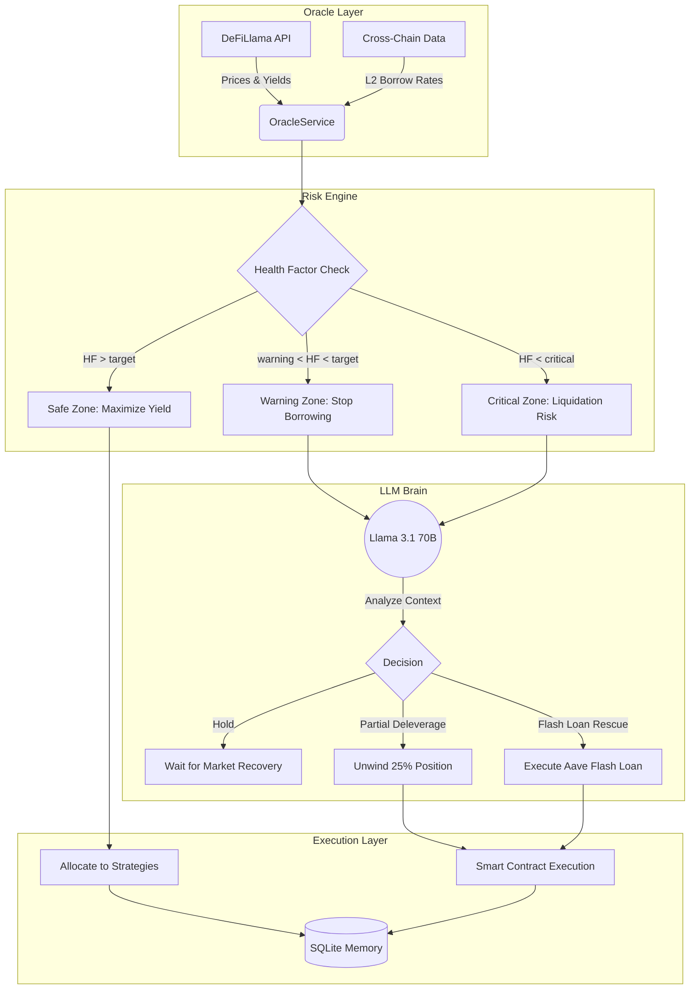

# 🧠 Aegis DeFAI Terminal: Deep Dive System Architecture

Aegis DeFAI Terminal is not just a simple "borrow/lend" bot. It is an autonomous, **Delta-Neutral** yield agent that performs institutional-grade risk management, analyzes market data in real-time, and makes AI-driven (LLM) decisions.

Here is a detailed breakdown of how the system works under the hood:

---

## 1️⃣ Data Aggregation & Cross-Chain Analysis 📡
The system checks the pulse of the market every cycle (default 15 seconds). It scans not only the Ethereum mainnet but also Layer-2 (L2) networks.

*   **Price & Yield Oracles:** Fetches real-time prices for ETH, USDC, and sUSDe, as well as live APY data from Ethena, Pendle, Morpho Blue, and Aave pools via DeFiLlama APIs.
*   **Cross-Chain Arbitrage:** The system compares borrowing costs on the Ethereum mainnet (e.g., 5% on Morpho Blue) with borrowing costs on L2 networks (e.g., Aave V3 on Arbitrum or Base). If borrowing on L2 is more profitable even after factoring in bridge costs, the agent considers moving funds to that network.

---

## 2️⃣ Advanced DeFi Strategies (Portfolio Allocation) 💼
The agent does not put all capital in one basket. To diversify risk and maximize yield, it allocates funds across 5 advanced strategies:

### 🎯 1. Pendle PT-sUSDe Arbitrage (55% of Portfolio)
*   **Logic:** Borrows USDC at a low rate via Aave V4 E-Mode or Morpho Blue. This USDC is swapped for Ethena's sUSDe and locked into a fixed yield on Pendle Finance by purchasing **PT-sUSDe (Principal Token)**.
*   **Why?** The spread between the borrowing cost and Pendle's fixed yield creates a risk-free arbitrage opportunity.

### 🏢 2. PT-syrupUSDC RWA (Real World Assets) (20% of Portfolio)
*   **Logic:** Utilizes fixed-yield tokens (syrupUSDC) offered by institutional RWA protocols like Maple Finance. This risk-free yield is multiplied using conservative leverage (4x) via Aave V4.
*   **Why?** Provides real-world yield backed by US Treasury Bills, completely independent of crypto market volatility.

### 🚀 3. Ethena sUSDe Leverage (15% of Portfolio)
*   **Logic:** Borrows USDC against sUSDe collateral on Morpho Blue, then swaps the borrowed USDC back to sUSDe (Looping).
*   **Why?** A medium-risk leverage strategy to maximize Ethena's high APY and ENA airdrop Points.

### 🛡️ 4. Pendle Boros YU Hedge (5% of Portfolio)
*   **Logic:** Ethena's yield depends on funding rates in perpetual futures. If funding rates turn negative, sUSDe yield drops. The agent hedges (insures) against this risk via Pendle Boros (Yield Utility).
*   **Why?** Prevents portfolio losses even when the market crashes and funding rates turn negative.

### 💧 5. Morpho USDC Revolver (5% of Portfolio)
*   **Logic:** A small portion of the portfolio is always kept liquid as USDC supply on Morpho Blue.
*   **Why?** Acts as an "emergency fund" ready to be used for flash loan rescues or sudden margin calls, while still earning a low yield.

---

## 3️⃣ Dynamic Risk Engine & Health Factor (HF) 🧮
Leveraged positions carry liquidation risk. The agent calculates this risk every second.

*   **Dynamic HF Calculation:** Calculated using the formula `HF = (Collateral Value * Liquidation Threshold) / Debt Value`. The price of the collateral (sUSDe) is fetched in real-time from the Oracle.
*   **Risk Zones** (risk-appetite based; defaults for Balanced — see `core/RiskEngine.js`):
    *   🟢 **Safe:** HF > target (1.25 default) — the agent continues to aggressively seek yield.
    *   🟡 **Warning:** HF between target−0.04 and target (1.21–1.25 default) — the agent stops taking new debt.
    *   🔴 **Critical:** HF < target−0.10 (1.15 default) — liquidation danger! Immediate intervention required.

---

## 4️⃣ AI Decision Mechanism (LLM Layer) 🤖
If the portfolio drops to the **Warning** or **Critical** level, the system does not panic sell like traditional bots. It consults the Llama 3.1 70B (or another chosen model) AI to recover the situation.

The following information is sent to the AI:
> *"Our current Health Factor is 1.15. We are in the Critical zone. I have X amount of sUSDe collateral, Y amount of USDC debt, and Z amount of emergency liquidity. What should I do?"*

The AI analyzes the situation and chooses one of the following actions:
*   ✅ **HOLD:** "The market drop is a temporary wick, we are far from liquidation, hold."
*   ⚠️ **PARTIAL_DELEVERAGE:** "To reduce risk, unwind 25% of the Ethena leverage position and repay debt."
*   🚨 **FLASH_LOAN_RESCUE:** "Emergency! Take a Flash Loan from Aave, fully repay the debt, rescue the collateral, and repay the Flash Loan."

*These decisions ensure the agent acts based on market context, not just hardcoded rules.*

---

## 5️⃣ Execution & Memory ⚡
*   **Memory:** Every decision made by the agent, along with its reasoning, is saved to the SQLite database (`decision_memory` table).
*   **Live Monitoring (Frontend):** You can sit back and watch this entire complex process from a modern interface. You can track your Total Value Locked (TVL), live APY, active chain (Ethereum/Arbitrum), and what the agent is currently thinking via a Matrix-like streaming terminal.
